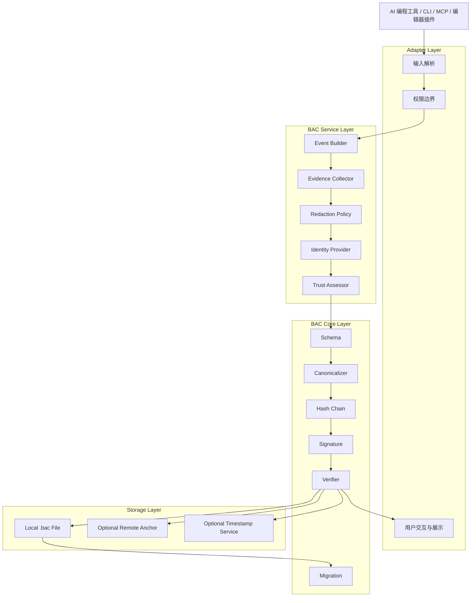
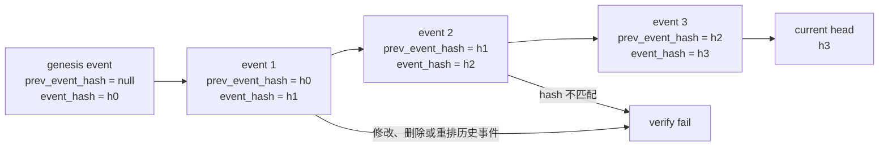
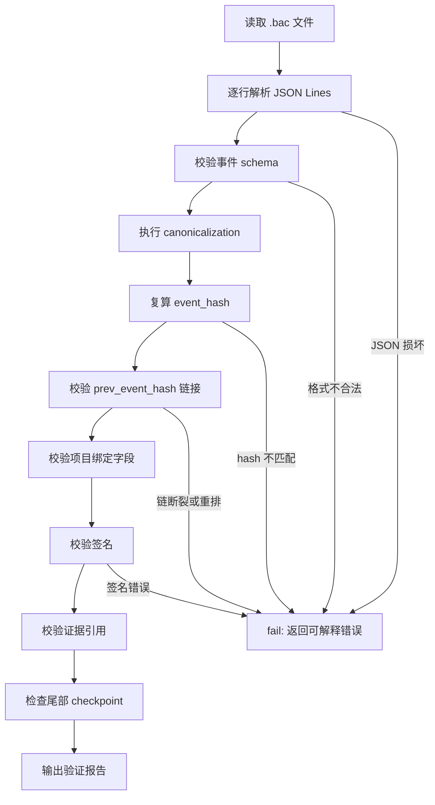
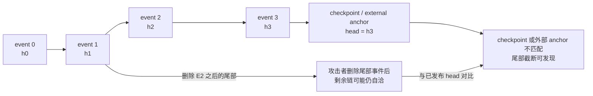

# BAC Architecture Design Implementation Plan

> **For Claude:** REQUIRED SUB-SKILL: Use superpowers:executing-plans to implement this plan task-by-task.

**Goal:** 设计 `bensz auto contribution` 的核心架构，使 AI 编程工具能够创建、追加、验证 `.bac` 贡献归因文件。

**Architecture:** 采用“轻核心 + 多适配器”架构：核心层只负责 `.bac` schema、规范化序列化、哈希链、签名和验证；服务层负责事件构造、证据采集和敏感信息过滤；适配器层对接 CLI、AI tool、MCP 或编辑器插件。`.bac` 文件以追加式事件账本为中心，安全目标是 tamper-evident，而不是不可修改。

**Tech Stack:** 初期语言栈待定；建议优先选择 TypeScript 或 Rust。数据格式建议使用 JSON Lines 或 CBOR Lines；哈希算法建议使用 SHA-256；签名算法建议使用 Ed25519；测试覆盖 schema、canonicalization、hash chain、signature、redaction 和异常输入。

**Minimal Change Scope:** 当前阶段只新增架构设计文档并更新变更记录；不实现代码、不确定最终语言栈、不引入运行时依赖。

**Success Criteria:** 方案能清晰说明系统边界、分层架构、`.bac` 事件模型、验证流程、威胁模型、MVP 范围和后续演进路径。

**Verification Plan:** 人工审阅本文档；后续实现阶段以 `bac init`、`bac record`、`bac verify`、`bac inspect` 的端到端用例作为最小验收。

---

## 背景

`auto-contribution` 的核心产物是 `.bac` 文件。它用于记录某个具体项目中人类、AI、工具和系统之间的贡献边界，并保留可审计证据。

本系统不应把 `.bac` 描述成“绝对不可篡改”的文件。更准确的安全目标是：通过追加式事件模型、规范化序列化、哈希链、签名、时间戳和项目上下文绑定，让篡改、重排、伪造和证据缺失尽可能可发现。

因此，`.bac` 更像一个“贡献证据账本”，而不是一个自动判定贡献归属的神谕系统。

## 设计目标

- 明确区分 `human`、`ai`、`tool`、`system` 四类来源。
- 支持 AI 编程工具以 tool 方式追加贡献记录。
- 记录需求、计划、生成、命令、文件变更、测试结果、人工审阅和最终授权。
- 使用追加式事件模型，避免原地覆盖历史事件。
- 使用哈希链验证事件顺序、完整性和上下文绑定。
- 支持签名和可信时间戳扩展，但 MVP 不强依赖外部服务。
- 默认过滤密钥、令牌、完整私有 prompt 和无关隐私。
- 验证失败时给出明确、可解释的失败原因。

## 非目标

- 不承诺 `.bac` 文件无法被删除或修改。
- 不试图仅凭 AI 自述证明代码一定由 AI 或人类创作。
- 不在第一版实现中心化平台、计费系统、复杂权限系统或多人协作门户。
- 不默认保存完整 prompt、完整命令输出或完整私有代码上下文。
- 不把 git 历史替换为 `.bac`，而是把 `.bac` 作为贡献审计补充层。

## 核心判断

最重要的架构判断是：贡献归因不能只信任声明，而要区分声明和证据。

例如，AI 说“我修改了 `src/main.ts`”只能算 `ai` 来源的声明事件；真正可验证的文件变化应由工具采集 `git diff`、文件 hash、测试输出摘要和命令退出码，再作为 `tool` 来源事件写入。

因此系统中的事件应分成两类：

- 声明事件：人类需求、AI 计划、AI 生成意图、人工审阅意见。
- 观察事件：命令执行结果、文件摘要、diff 摘要、测试结果、签名 checkpoint。

验证器应优先信任可复算、可签名、可绑定上下文的观察事件。

## 总体架构



## Adapter Layer

适配器层负责把不同调用环境统一映射到内部服务接口。

初期建议只实现 CLI 和一个通用 JSON-RPC 或 MCP 风格 tool 接口。不要一开始为每个 AI 编程工具写深度插件。

建议接口：

```text
bac init
bac record
bac verify
bac inspect
```

后续再扩展：

```text
bac checkpoint
bac redact
bac export
bac migrate
```

适配器层不直接计算安全关键字段。它只负责输入解析、权限边界、用户交互和展示。

## BAC Service Layer

服务层负责把“用户或 AI 请求”转成“可写入 `.bac` 的事件”。

### Event Builder

负责构造事件对象，补齐时间戳、项目绑定、调用上下文和基础元数据。

事件构造必须显式标记来源：

```text
human
ai
tool
system
```

事件还应标记可信度：

```text
declared
observed
signed
verified
anchored
```

`source_type` 表示谁产生了事件；`trust_level` 表示这条事件目前可被信任到什么程度。

### Evidence Collector

负责采集可验证证据。MVP 中建议支持：

- 当前 git commit。
- 当前 git branch。
- 工作区 dirty 状态。
- 文件路径列表。
- 文件 SHA-256 摘要。
- git diff 摘要。
- 命令、退出码、开始时间、结束时间。
- 测试结果摘要。

完整命令输出应默认截断或摘要化；敏感输出需要经过过滤。

### Redaction Policy

负责过滤不应写入 `.bac` 的内容。

默认过滤：

- API key、token、secret、cookie。
- 私钥、助记词、证书。
- 完整私有 prompt。
- 与贡献审计无关的个人隐私。
- 超大命令输出和二进制内容。

过滤策略应产生 `redaction` 元数据，说明哪些字段被替换、替换原因是什么，但不泄露原始敏感值。

### Identity Provider

负责身份声明和签名。

MVP 可以支持两类身份：

- `declared_identity`：用户或工具声明的身份，可信度较低。
- `signed_identity`：使用本地密钥签名的身份，可信度较高。

后续可扩展到 Git 签名、SSH 签名、Sigstore、OIDC、硬件密钥或组织身份系统。

## BAC Core Layer

核心层应尽量纯函数化，避免依赖终端、文件系统和具体 AI 工具。它应适合被 CLI、MCP server 和测试直接调用。

### Schema

建议 `.bac` 文件采用 JSON Lines。每行是一条 canonical JSON 事件。

选择 JSON Lines 的原因：

- 追加简单。
- 易于流式验证。
- 人类可读。
- 生态成熟。
- 适合后续压缩、签名和远程同步。

如果未来需要更强的二进制稳定性，可以引入 CBOR Lines，但第一版不建议增加复杂度。

### Canonicalizer

哈希和签名必须基于稳定序列化结果。

规范化要求：

- 对象键排序。
- 去除不参与签名的展示字段。
- 时间戳格式固定。
- 数字、布尔值、空值表示固定。
- 字符串编码固定为 UTF-8。
- 换行符固定。

不要直接对用户输入的原始 JSON 字符串计算 hash，因为字段顺序和空白字符会导致不可复算。

### Hash Chain

每条事件包含前序摘要：

```json
{
  "prev_event_hash": "sha256:...",
  "event_hash": "sha256:..."
}
```

`event_hash` 应基于事件 canonical payload 计算，但不应把 `event_hash` 自身纳入计算。

第一条事件为 genesis event：

```json
{
  "event_type": "genesis",
  "prev_event_hash": null
}
```

哈希链用于把事件内容、事件顺序和项目上下文绑定到一起：



验证器应检查：

- 每条事件格式合法。
- `prev_event_hash` 指向上一条事件的 `event_hash`。
- 当前 `event_hash` 可复算。
- 事件时间没有明显逆序异常。
- 项目绑定信息一致。
- 签名字段可验证。
- 被引用文件摘要和当前文件是否匹配，或明确标记为历史状态。

### Signature

签名目标应是 canonical event payload。

建议签名字段：

```json
{
  "signature": {
    "algorithm": "ed25519",
    "key_id": "local:user@example.com:...",
    "public_key": "...",
    "signature_value": "...",
    "signed_at": "2026-05-26T10:30:00Z"
  }
}
```

MVP 可以允许未签名事件，但验证报告必须明确区分：

- 格式完整但未签名。
- 哈希链完整但身份未验证。
- 签名存在但不可验证。
- 签名有效。

## Storage Layer

本地存储建议默认放在项目根目录：

```text
project.bac
```

或放入隐藏目录：

```text
.bac/events.bac
```

两种方案各有取舍：

- 单文件 `project.bac` 简单直观，适合 MVP。
- `.bac/events.bac` 更适合后续存放密钥引用、anchor、索引和缓存。

建议 MVP 使用单文件 `project.bac`，后续如果需要扩展，再迁移到 `.bac/` 目录结构。迁移能力由 core migration 模块负责，不让适配器各自处理。

## `.bac` 事件草案

建议事件基础结构如下：

```json
{
  "format": "bac.v1",
  "event_id": "01J...",
  "event_type": "file_change",
  "source_type": "tool",
  "trust_level": "observed",
  "created_at": "2026-05-26T10:30:00Z",
  "project": {
    "root_hash": "sha256:...",
    "git_remote": "git@github.com:owner/repo.git",
    "git_commit": "abc123",
    "git_branch": "main",
    "worktree_dirty": true
  },
  "actor": {
    "declared_name": "Codex",
    "declared_kind": "ai_tool",
    "session_id": "..."
  },
  "payload": {
    "summary": "Updated verification logic",
    "files": [
      {
        "path": "src/verify.ts",
        "before_hash": "sha256:...",
        "after_hash": "sha256:...",
        "diff_hash": "sha256:..."
      }
    ]
  },
  "evidence": [
    {
      "type": "git_diff_summary",
      "hash": "sha256:...",
      "redacted": false
    }
  ],
  "redactions": [],
  "prev_event_hash": "sha256:...",
  "event_hash": "sha256:...",
  "signature": null
}
```

## 事件类型

MVP 建议支持：

- `genesis`：创建 `.bac` 文件。
- `session_started`：记录一次 AI 协作会话开始。
- `human_instruction`：记录人类需求、约束或授权。
- `ai_plan`：记录 AI 方案或任务拆解。
- `ai_generation`：记录 AI 生成或修改意图。
- `tool_command`：记录命令执行结果。
- `file_snapshot`：记录文件摘要。
- `file_change`：记录文件实际变化。
- `test_result`：记录验证命令和结果摘要。
- `human_review`：记录人工审阅意见。
- `human_approval`：记录人工最终确认。
- `checkpoint`：记录签名或外部锚定点。
- `verification`：记录对 `.bac` 的验证结果。

第一版可以只实现其中的最小集合：

- `genesis`
- `human_instruction`
- `ai_generation`
- `tool_command`
- `file_change`
- `test_result`
- `checkpoint`

## 验证流程

`bac verify` 应执行以下步骤：

- 逐行解析 `.bac`。
- 校验每条事件 schema。
- 对每条事件进行 canonicalization。
- 复算 `event_hash`。
- 校验 `prev_event_hash` 链接。
- 校验项目绑定字段是否一致。
- 校验签名。
- 校验证据引用是否存在或可复算。
- 检查尾部 checkpoint 是否存在。
- 输出验证报告。



验证报告至少包含：

```text
status: pass | warn | fail
checked_events: number
head_hash: sha256:...
signature_status: signed | partially_signed | unsigned | invalid
anchor_status: anchored | not_anchored | invalid
warnings: []
errors: []
```

验证失败不能静默通过。只要哈希链断裂、事件 hash 不匹配或签名错误，应返回失败。

## 威胁模型

### 需要覆盖的风险

- 修改历史事件内容。
- 删除中间事件。
- 重排事件顺序。
- 伪造 AI 或人类来源声明。
- 在 `.bac` 中写入敏感信息。
- 文件变化和贡献声明不一致。
- 验证器遇到损坏输入时静默成功。

### 部分覆盖的风险

- 删除尾部事件：哈希链本身难以发现，需要 checkpoint 或外部 anchor。
- 伪造未签名身份：只能标记为低信任声明。
- 恶意本地工具伪造输出：需要签名、沙箱、远程证明或多源证据增强。
- 系统时间被篡改：需要可信时间戳服务增强。

### 不覆盖的风险

- 攻击者完全控制用户机器、密钥和 `.bac` 文件。
- 攻击者删除整个仓库和所有远程备份。
- 法律意义上的作者身份最终裁定。
- 对未被采集的口头沟通或离线编辑进行自动归因。

## 尾部截断问题

单纯哈希链可以发现中间篡改，但不能可靠发现攻击者删除最后几条事件。

建议通过 checkpoint 逐步增强：

- MVP：本地签名 checkpoint。
- 第二阶段：把 head hash 写入 git commit message、git note 或 release artifact。
- 第三阶段：远程 registry 或可信时间戳服务。
- 第四阶段：组织级透明日志。



在文档和产品表达中必须明确：没有外部 anchor 时，尾部截断只能降低风险，不能完全防止。

## MVP 范围

第一阶段只做本地可用闭环：

```text
bac init
bac record
bac verify
bac inspect
```

### `bac init`

创建 `.bac` 文件并写入 genesis event。

记录：

- format version。
- 项目根目录。
- git remote。
- 当前 commit。
- 当前 branch。
- 创建时间。
- 工具版本。

### `bac record`

追加事件。

支持输入：

- `source_type`
- `event_type`
- `summary`
- `files`
- `command`
- `evidence`

追加前应读取当前 head hash，追加后应复算并写入新 head。

### `bac verify`

验证 `.bac` 完整性。

输出机器可读 JSON 和人类可读文本两种模式。

### `bac inspect`

展示贡献时间线。

按时间和事件类型展示：

- 人类需求。
- AI 计划和生成。
- 工具命令。
- 文件变化。
- 测试结果。
- 人工确认。

## 推荐模块划分

如果使用 TypeScript：

```text
src/
  core/
    schema.ts
    canonicalize.ts
    hash-chain.ts
    signature.ts
    verify.ts
    migrate.ts
  service/
    event-builder.ts
    evidence-collector.ts
    redaction.ts
    identity.ts
  adapters/
    cli.ts
    tool-api.ts
  storage/
    bac-file.ts
  report/
    inspect.ts
    verify-report.ts
tests/
  core/
  service/
  adapters/
```

如果使用 Rust：

```text
src/
  core/
  service/
  adapters/
  storage/
  report/
tests/
```

无论选择哪种语言，安全关键逻辑都应集中在 `core`，避免散落在 CLI 或 AI tool adapter 中。

## 测试策略

必须覆盖：

- 正常创建 genesis event。
- 正常追加事件。
- 正常验证完整链。
- 修改历史事件后验证失败。
- 删除中间事件后验证失败。
- 重排事件后验证失败。
- 伪造 `event_hash` 后验证失败。
- 签名有效时验证通过。
- 签名损坏时验证失败。
- 未签名事件返回 warning 而不是伪装成 verified。
- 敏感信息被 redaction policy 过滤。
- 损坏 JSON 行返回可解释错误。
- 版本不兼容时返回明确错误。

测试数据应放在 `tests/fixtures`，避免把真实密钥、真实私有 prompt 或真实用户数据写入仓库。

## 实施里程碑

### Milestone A：格式和威胁模型

- 确定 `.bac` v1 schema。
- 写出 threat model 文档。
- 写出 canonicalization 规则。
- 写出验证报告格式。

### Milestone B：核心库

- 实现 schema parse。
- 实现 canonicalization。
- 实现 hash chain append 和 verify。
- 实现验证报告。
- 添加核心测试。

### Milestone C：本地 CLI

- 实现 `bac init`。
- 实现 `bac record`。
- 实现 `bac verify`。
- 实现 `bac inspect`。
- 添加端到端测试。

### Milestone D：证据采集

- 采集 git 状态。
- 采集文件 hash。
- 采集 diff 摘要。
- 采集命令执行结果。
- 接入 redaction policy。

### Milestone E：AI Tool 集成

- 设计 tool API。
- 支持 AI 记录计划、生成、命令意图和验证结果。
- 支持人类授权事件。
- 增加示例项目。

### Milestone F：签名和锚定

- 接入 Ed25519 签名。
- 支持本地身份配置。
- 支持 checkpoint。
- 评估 git note、远程 registry 或可信时间戳服务。

## 后续决策点

需要进一步确认：

- 第一版语言栈选择 TypeScript 还是 Rust。
- `.bac` 默认是单文件 `project.bac` 还是 `.bac/events.bac`。
- AI tool 协议优先支持 MCP 还是自定义 JSON-RPC。
- 是否把签名放入 MVP，还是作为第二阶段能力。
- 是否需要独立的 `docs/specs/bac-v1.md` 规格文档。

## 推荐路线

建议采用以下路线：

- 第一版使用单文件 JSON Lines `.bac`。
- 第一版先做 CLI 和核心库，不急于做服务端。
- 第一版允许未签名事件，但验证报告必须明确标记信任等级。
- 第一版必须实现哈希链和 redaction。
- 第二版再加入签名 identity 和 checkpoint。
- 第三版再考虑远程 anchor、透明日志和组织级身份。

这个路线能让项目快速得到一个可验证、可演示、可被 AI tool 调用的最小闭环，同时为后续安全增强留下清晰接口。
